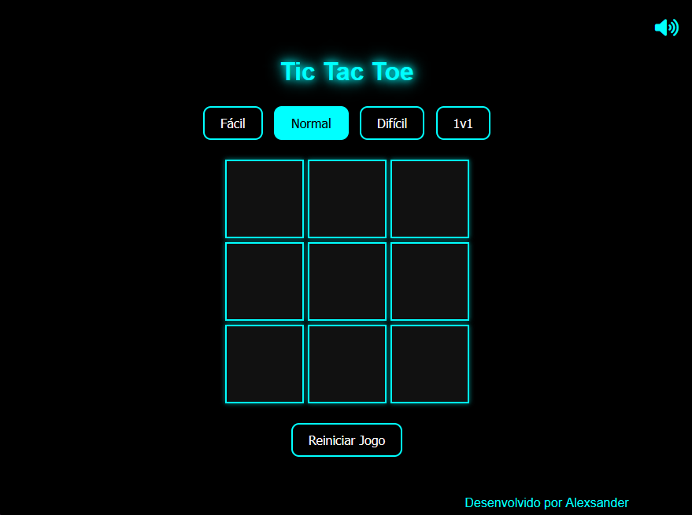

# Tic Tac Toe

## Overview

Tic Tac Toe is a classic game implemented with a user-friendly interface, smooth animations, and engaging sound effects. This project allows players to enjoy matches against the AI at three difficulty levels (Easy, Normal, Hard) or against another player in the 1v1 mode.



## Features

- **Three Difficulty Levels:** Play against the AI in Easy, Normal, and Hard modes.
- **1v1 Mode:** Challenge a friend in a Tic Tac Toe match.
- **Animations:** Smooth transitions for inserting 'X' and 'O' and an animated neon line to indicate victory.
- **Sound Effects:** Audio feedback for actions like clicks, grid moves, and game results.
- **Responsive Design:** Interface adapts well to different screen sizes.

## Live Demo

Check out the live demo of the game [here](https://alexsanderme.github.io/tic_tac_toe-web/).

## Directory Structure

```
tic_tac_toe-web/
├── assets/
│   └── sounds/
│       ├── background.mp3
│       ├── button-click.mp3
│       ├── button-hover.mp3
│       ├── button-restart.mp3
│       ├── click.wav
│       ├── grid-hover.wav
│       ├── lose.wav
│       ├── tied.wav
│       └── win.wav
│
├── css/
│   └── styles.css
│
├── js/
│   └── game.js
│
├── screenshots/
│   └── interface.png
│
└── index.html
```

## How to Run the Project

1. **Clone the Repository:**
   ```sh
   git clone https://github.com/AlexsanderMe/tic_tac_toe-web.git
   ```
2. **Navigate to the Project Directory:**
   ```sh
   cd tic_tac_toe-web
   ```
3. **Open the `index.html` file in your browser:**
   - You can simply drag the `index.html` file into a browser window or open it via the browser's file menu.

## Technologies Used

- **HTML:** Basic structure of the application.
- **CSS:** Styling and animations.
- **JavaScript:** Game logic and DOM manipulation.
- **Sound Effects:** Add an extra layer of interactivity to the game.

## Contributions

Contributions are welcome! If you have ideas to improve the project, feel free to open an issue or submit a pull request.

## License

This project is licensed under the [MIT License](LICENSE).
